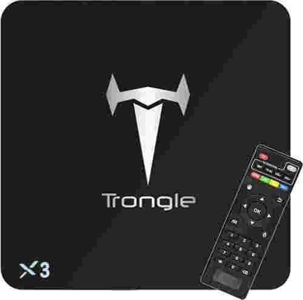

# S905X

## 简介

在某二手市场入手了一个电视盒子，盒子型号为`Trongle X3`，主控为**S905X**。

搜索发现，这个型号的盒子与`MINI M8S II`这个盒子外形/PCB等完全一致，并且可以直接使用`p212`设备树启动内核，只有内存容量与EMMC容量略有不同，其外形/PCB等图片如下。

**电视盒子内部图片来自[这里](https://www.cnx-software.com/2016/07/13/mini-m8s-ii-tv-box-amlogic-s905x-review-part-1-unboxing-and-teardown/)**。




## 数据手册

[S905X数据手册](S905X_Datasheet.pdf)

[S905X GPIO用户指南](S905X_GPIO_User_Guide.pdf)

## 启动流程

S905X的启动流程见数据手册中的`18.2`小节，关于启动流程中提到的`recovery`信号，可以通过`Amlogic HDMI Boot Dongle`设备来进行控制，详细的说明可以参考[这里](https://github.com/superna9999/linux/wiki/Amlogic-HDMI-Boot-Dongle)，**本小节后续内容全部来自此处**。

Amlogic BOOTROM在启动过程中会通过HDMI接口中的I2C总线从地址`0x52`，偏移`0xf8(248)`处读取8字节内容，如果这8字节内容是`boot@USB`那么会强制从USB进行启动。相应的，如果内容是`boot@SDC`和`boot@SPI`那么会强制从SD卡和SPI进行启动。

`Amlogic HDMI Boot Dongle`设备的原理图如下图所示，主要元器件为一个EEPROM。


Linux平台中通过i2c-dev驱动写数据到eeprom的方法如下：

```shell
$ cd /sys/bus/i2c/devices/i2c-0
$ echo 24c02 0x52 > new_device
$ cd *-0052
$ echo -n "boot@USB" | dd of=eeprom bs=1 seek=248 count=8
$ dd if=eeprom bs=1 skip=248 | hexdump
$ # If the last byte of data not flashed correctly
$ echo -n "B" | dd of=eeprom bs=1 seek=255 count=1
```

## 系统烧录

电视盒子默认运行的系统是Android，也可以使用网友提供的预编译镜像来运行Debian等发行版。

经过测试，[ophub](https://github.com/ophub)提供的Armbian可以正常启动和使用，详细的下载安装方式可以参考[这里](https://github.com/ophub/amlogic-s9xxx-armbian/)。

此型号的电视盒子对应的u-boot与dtb分别为`u-boot-s905x-s912.bin`和`meson-gxl-s905x-p212.dtb`。

## u-boot编译

经过测试，使用上游u-boot的`p212_defconfig`配置文件编译出的u-boot二进制可以直接使用盒子自带的u-boot运行起来，但是如果要制作可启动的u-boot镜像的话还需要从EMMC中导出自带的u-boot，随后提取出BL2x、BL3x等并进行进一步处理，简单流程如下:

```shell
$ dd if=/dev/block/bootloader of=bootloader.dump
$ dd if=bootloader.dump of=dump.bin bs=512 skip=1
$ gxlimg -e dump.bin images
$ gxlimg -t bl3x -c u-boot-dtb.bin u-boot.bin.enc
$ gxlimg -t fip --bl2 ./bl2.sign --bl30 ./bl30.enc --bl31 ./bl31.enc --bl33 ./u-boot.bin.enc ./gxl-boot.bin
```

上述流程的基本原理是使用原有镜像中的BL2x、BL3x等部分配合自行编译出的u-boot，将其组合成一个新的可启动的bootloader，详细原理及介绍可以参考[这里](https://github.com/hexdump0815/u-boot-misc/tree/master/misc.gxl)和[这里](https://github.com/repk/gxlimg)

## 参考链接

[Mini M8S II TV Box (Amlogic S905X) Review – Part 1: Unboxing and Teardown](https://www.cnx-software.com/2016/07/13/mini-m8s-ii-tv-box-amlogic-s905x-review-part-1-unboxing-and-teardown/)

[Amlogic HDMI Boot Dongle](https://github.com/superna9999/linux/wiki/Amlogic-HDMI-Boot-Dongle)

[amlogic-s9xxx-armbian](https://github.com/ophub/amlogic-s9xxx-armbian/)

[u-boot-misc](https://github.com/hexdump0815/u-boot-misc)

[glximg](https://github.com/repk/gxlimg)
