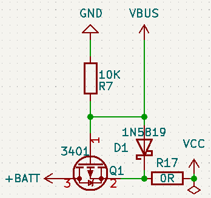

# 场效应管

## 参考资料

[MOS管的工作原理](https://www.bilibili.com/video/BV1yr4y1K7Vx/)

[一文彻底弄清MOS管 （NMOS为例）](https://zhuanlan.zhihu.com/p/368263926)

## 工作原理

场效应管依靠电场来控制导电沟道，从而达到控制电流的目的。

以上图NMOS为例，在门极(G)与衬底(B)未施加电场的情况下，源极(S)与衬底(B)、漏极(D)与衬底(B)间存在耗尽层，将会阻止电子流动。

当在门极(G)与衬底(B)间施加正向电压时，基底中的少数子即电子会被吸引到门极(G)侧，多数子空穴被吸引到衬底(B)一侧，此时两极中间会形成新的耗尽曾，而源级(S)与漏极(D)间存在的源极(S)与衬底(B)、漏极(D)与衬底(B)间的耗尽层将被吸引到门极的电子打破，此时电子便可以在源级与漏极间自由流动了，此时MOS管便导通了。

打破原有耗尽层的部分被称为沟道，沟道由衬底中电子被吸引而来形成的就叫N沟道，反之就叫P沟道。

## 电路符号

MOS管标准符号中，衬底的箭头表示衬底中电子的移动方向。从上述符号中可以看出日常使用的普通类型的场效应管衬底(B)应该是与源极(S)相连的，还是以NMOS为例，从其工作原理我们可以得知要想使其导通，需要在门级(G)与衬底(B)间施加正向电场，对应到数据手册中为Vgs的电压值，为一个大于0的值。

因此在设计电路时我们将源级(S)接地，通过控制门级(G)的高低电平变化便可以控制NMOS的导通与关断了。

## 常用电路

USB供电与电池供电切换电路(PMOS)

电池电压检测通断控制电路(PMOS)

