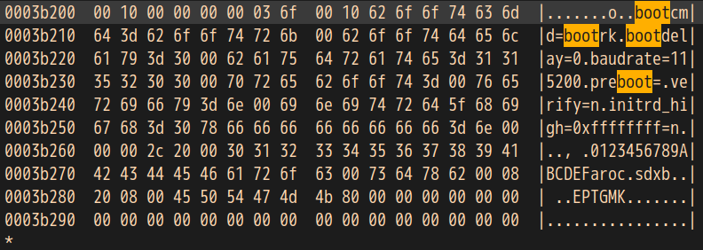
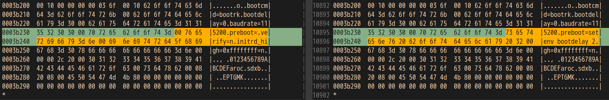

# RK3128

## EC6108V9A

### 救砖

朋友给了一个华为悦盒EC6108V9A电视盒子，采用RK3128作为主控，想试着把其中的系统更换为Debian，这样可玩性更高一点。

搜索发现Firefly提供完整的RK3128 Ubuntu镜像，于是从Firefly提供的资源中下载了预编译好的Ubuntu镜像，结果完全无法启动，连boot输出都没有，只好从网上搜索了一下线刷包，并将其进行了还原，还在结果不错，还原成功。线刷救砖包可以从[这里](https://pan.baidu.com/s/17e153oQ5ehDpzVHJudLaAg?pwd=b29w)下载。

由于此时盒子完全无响应，因此需要通过短接点让其进入maskrom模式进行刷机，短接点如下。


### Uboot截停

由于盒子的默认Uboot启动延迟为0,因此无法让其停在Uboot的命令行。观察了一下救砖包解包后的Uboot的二进制文件，发现是裸文件，并未经过加密等相关操作，因此决定从Uboot的二进制文件入手进行尝试。关键改动部分如下图所示。



经过观察，发现Uboot二进制中存在默认环境变量`bootdelay`，便尝试修改该环境变量的值让启动延迟不为零，结果居然不生效，百思不得其解，于是从github中搜了一份rockchip的Uboot代码进行分析，发现在板级初始化部分居然有调整环境变量的[操作](https://github.ink/gjianw217/firefly-aio3128c-rk3128-uboot/blob/master/board/rockchip/rk32xx/rk32xx.c#L119)，代码如下

```c
static void board_init_adjust_env(void)
{
	bool change = false;

	char *s = getenv("bootdelay");
	if (s != NULL) {
		unsigned long bootdelay = 0;

		bootdelay = simple_strtoul(s, NULL, 16);
		debug("getenv: bootdelay = %lu\n", bootdelay);
#if (CONFIG_BOOTDELAY <= 0)
		if (bootdelay > 0) {
			setenv("bootdelay", simple_itoa(0));
			change = true;
			debug("setenv: bootdelay = 0\n");
		}
#else
		if (bootdelay != CONFIG_BOOTDELAY) {
			setenv("bootdelay", simple_itoa(CONFIG_BOOTDELAY));
			change = true;
			debug("setenv: bootdelay = %d\n", CONFIG_BOOTDELAY);
		}
#endif
	}
```

不难看出修改的环境变量在这里被还原成了编译时的值，因此没有生效。

继续进行分析，发现环境变量中还有`preboot`，这个环境变量会在进入命令行循环前被执行，此时板级初始化部分已经结束，且板级初始化部分也未对该环境变量进行调整，因此可以借助这个环境变量重新调整bootdelay的值。对此处内容进行修改，修改前后对比如下。



修改完成之后，Uboot倒计时便会变为2秒，此时便可以中断倒计时，供我们进行一些操作了。

### 引导内核及Debian系统

在成功截停Uboot后，发现该Uboot提供的命令极少，并没有常见的emmc读取等命令，因此只能借助原有的bootrk命令来引导内核及Debian。

从线刷包中解出boot.img镜像，随后使用debootstrap命令构建一个最小armhf debian文件系统，并将文件系统制作成ext2文件系统的镜像，修改package-file和parameter文件，主要是对打包文件和mtd分区表进行修改，修改后使用rockchip提供的打包工具重新打包回统一镜像，并进行烧录。如果操作无误的话便可以成功启动到Debian环境了，完整启动log如下

```
U-Boot 2014.10-RK3128-01-01497-g3464f5e (Jun 17 2015 - 20:20:17)

CPU: rk3128
CPU's clock information:
    arm pll = 600000000HZ
    periph pll = 594000000HZ
    ddr pll = 600000000HZ
    codec pll = 400000000HZ
Board:  Rockchip platform Board
Uboot as second level loader
DRAM:  Found dram banks:1
Adding bank:0000000060000000(0000000040000000)
128 MiB
rk dma pl330 version: 1.1
remotectl v0.1
storage init OK!
Using default environment

GetParam
check parameter success
Unknow param: MACHINE_MODEL:rk3036!
Unknow param: MACHINE_ID:007!
Unknow param: MANUFACTURER:RK30SDK!
power key: bank-0 pin-5
SecureBootEn = 0, SecureBootLock = 0

#Boot ver: 2015-06-17#2.20
empty serial no.
checkKey
vbus = 1
board_fbt_key_pressed: ir_keycode = 0x0, frt = 0
read logo_on switch from dts [1]
can't find power_ctr node for lcdc0
read_deviceinfo_storage:p_deviceinfo=0x67d00000,p_baseparamer=0x67e00000
failed to find part:deviceinfo
uboot changed by Huawei for CA!!!!!!!!!!!!!
failed to find part:baseparamer
[EDID-EXTEND] It is a  CEA 861 Series Extension.
no baseparametr,find best edid mode,vic=16
input_color=1,output_color=0
sucess output HDMI.
failed to find part:logo
failed to find part:resource
show_resource_image:show logo from resource or boot partition
checkKey
vbus = 1
board_fbt_key_pressed: ir_keycode = 0x0, frt = 0
failed to find part:misc
misc partition not found!
Hit any key to stop autoboot:  0 
rkboot # 
rkboot # bootrk boot
kernel   @ 0x62000000 (0x0064dd88)
ramdisk  @ 0x64bf0000 (0x00000200)
CML tvetestmode is =0
Secure Boot state: 0
bootrk: do_bootm_linux...
   Loading Device Tree to 64515000, end 6452b87f ... OK
Add bank:0000000060000000, 0000000040000000

Starting kernel ...

<hit enter to activate fiq debugger>
[    0.000000] Booting Linux on physical CPU 0xf00
[    0.000000] Initializing cgroup subsys cpu
[    0.000000] Initializing cgroup subsys cpuacct
[    0.000000] Linux version 3.10.0 (liujunjie@HW-TV-S1) (gcc version 4.6.x-google 20120106 (prerelease) (GCC) ) #16 SMP PREEMPT Tue Jun 16 23:15:18 CST 2015
[    0.000000] CPU: ARMv7 Processor [410fc075] revision 5 (ARMv7), cr=10c5387d
[    0.000000] CPU: PIPT / VIPT nonaliasing data cache, VIPT aliasing instruction cache
[    0.000000] Machine: Rockchip RK3128, model: rockchip,rk3128
[    0.000000] get_bootmode: storagemedia=emmc, flag_uboot_bootmode_nand=0
[    0.000000] hdmi init vic is 16
[    0.000000] cvbs init tve.format is -1
[    0.000000] cvbs init tve.testmode is 0
[    0.000000] rockchip_ion_reserve
[    0.000000] ion heap(cma): base(0) size(800000) align(0)
[    0.000000] ion heap(vmalloc): base(0) size(0) align(0)
[    0.000000] cma: CMA: reserved 8 MiB at 9f800000
[    0.000000] ion_reserve: cma reserved base 9f800000 size 8388608
[    0.000000] rockchip_deviceinfo_reserve:
[    0.000000] rockchip_deviceinfo_find_reserve_mem:enable=1,base=0x67d00000,size=0x200000
[    0.000000] cma: CMA: reserved 16 MiB at 8e800000
[    0.000000] Memory policy: ECC disabled, Data cache writealloc
[    0.000000] Boot mode: REBOOT (6) flag: NORMAL (0xc3524200)
[    0.000000] PERCPU: Embedded 9 pages/cpu @c15ae000 s14016 r8192 d14656 u36864
[    0.000000] Built 1 zonelists in Zone order, mobility grouping on.  Total pages: 260624
[    0.000000] Kernel command line: root=/dev/mmcblk0p4 rw console=ttyFIQ0  mtdparts=rk29xxnand:0x00000800@0x00002000(fastboot),0x00008000@0x00002800(recovery),0x00006000@0x0000a800(boot),-@
0x00010800(system) storagemedia=emmc loader.timestamp=2015-06-17_20:20:17 hdmi.vic=16 tve.format=-1 tve.test=0 ir.keycode=0x0
[    0.000000] PID hash table entries: 4096 (order: 2, 16384 bytes)
[    0.000000] Dentry cache hash table entries: 131072 (order: 7, 524288 bytes)
[    0.000000] Inode-cache hash table entries: 65536 (order: 6, 262144 bytes)
[    0.000000] allocated 2097152 bytes of page_cgroup
[    0.000000] please try 'cgroup_disable=memory' option if you don't want memory cgroups
[    0.000000] Memory: 1024MB = 1024MB total
[    0.000000] Memory: 996640k/996640k available, 51936k reserved, 262144K highmem
[    0.000000] Virtual kernel memory layout:
[    0.000000]     vector  : 0xffff0000 - 0xffff1000   (   4 kB)
[    0.000000]     fixmap  : 0xfff00000 - 0xfffe0000   ( 896 kB)
[    0.000000]     vmalloc : 0xf0000000 - 0xff000000   ( 240 MB)
[    0.000000]     lowmem  : 0xc0000000 - 0xef800000   ( 760 MB)
[    0.000000]     pkmap   : 0xbfe00000 - 0xc0000000   (   2 MB)
[    0.000000]     modules : 0xbf000000 - 0xbfe00000   (  14 MB)
[    0.000000]       .text : 0xc0008000 - 0xc0b01884   (11239 kB)
[    0.000000]       .init : 0xc0b02000 - 0xc0b5b6c0   ( 358 kB)
[    0.000000]       .data : 0xc0b5c000 - 0xc0c639b8   (1055 kB)
[    0.000000]        .bss : 0xc0c639b8 - 0xc0d83044   (1150 kB)
[    0.000000] SLUB: HWalign=64, Order=0-3, MinObjects=0, CPUs=4, Nodes=1
[    0.000000] Preemptible hierarchical RCU implementation.
[    0.000000]  RCU dyntick-idle grace-period acceleration is enabled.
[    0.000000] NR_IRQS:16 nr_irqs:16 16
[    0.000000] rk_clk_tree_init start! cru base = 0xfed00000
[    0.000000] rk_get_uboot_display_flag: uboot_logo_on = 1
[    0.000000] rkclk_init_clks: cnt_parent = 25
[    0.000000] rkclk_init_clks: cnt_rate = 17
[    0.000000] Architected cp15 timer(s) running at 24.00MHz (phys).
[    0.000000] Switching to timer-based delay loop
[    0.000000] sched_clock: ARM arch timer >56 bits at 24000kHz, resolution 41ns
[    0.000000] process version: 0
[    0.000000] channel:0, lkg:25
[    0.000000] target-temp:85
[    0.000000] channel:0, lkg:25
[    0.000000] target-temp:85
[    0.000000] channel:0, lkg:25
[    0.000000] target-temp:85
[    0.000000] sched_clock: 32 bits at 100 Hz, resolution 10000000ns, wraps every 4294967286ms
[    0.274709] Calibrating delay loop (skipped), value calculated using timer frequency.. 48.00 BogoMIPS (lpj=240000)
[    0.274735] pid_max: default: 32768 minimum: 301
[    0.274943] Security Framework initialized
[    0.274972] SELinux:  Initializing.
[    0.275103] Mount-cache hash table entries: 512
[    0.276333] Initializing cgroup subsys debug
[    0.276361] Initializing cgroup subsys memory
[    0.276413] Initializing cgroup subsys freezer
[    0.276477] CPU: Testing write buffer coherency: ok
[    0.277007] /cpus/cpu@0 missing clock-frequency property
[    0.277033] /cpus/cpu@1 missing clock-frequency property
[    0.277053] /cpus/cpu@2 missing clock-frequency property
[    0.277071] /cpus/cpu@3 missing clock-frequency property
[    0.277143] CPU0: thread -1, cpu 0, socket 15, mpidr 80000f00
[    0.277215] Setting up static identity map for 0xc07ed420 - 0xc07ed478
[    0.279593] last_log: 0x8e100000 map to 0xf0004000 and copy to 0xf0086000, size 0x80000 early 0x1648 (version 3.0)
[    0.352676] CPU1: Booted secondary processor
[    0.352733] CPU1: thread -1, cpu 1, socket 15, mpidr 80000f01
[    0.372363] CPU2: Booted secondary processor
[    0.372408] CPU2: thread -1, cpu 2, socket 15, mpidr 80000f02
[    0.392120] CPU3: Booted secondary processor
[    0.392166] CPU3: thread -1, cpu 3, socket 15, mpidr 80000f03
[    0.392358] Brought up 4 CPUs
[    0.392410] SMP: Total of 4 processors activated (192.00 BogoMIPS).
[    0.392425] CPU: All CPU(s) started in SVC mode.
[    0.393859] devtmpfs: initialized
[    0.403214] pinctrl core: initialized pinctrl subsystem
[    0.403717] regulator-dummy: no parameters
[    0.405244] NET: Registered protocol family 16
[    0.408167] DMA: preallocated 256 KiB pool for atomic coherent allocations
[    0.408733] ion_snapshot: 0x8e218000 map to 0xf0107000 and copy to 0xc0d5e504 (version 0.1)
[    0.408972] Registered FIQ tty driver
[    0.410879] console [ttyFIQ0] enabled
[    0.411341] Registered fiq debugger ttyFIQ0
[    0.412563] rockchip_get_bank_data:name=/pinctrl@20008000/gpio0@2007c000 start=0x2007c000,end=0x2007c0ff
[    0.412704] rockchip_get_bank_data:name=/pinctrl@20008000/gpio1@20080000 start=0x20080000,end=0x200800ff
[    0.412784] rockchip_get_bank_data:name=/pinctrl@20008000/gpio2@20084000 start=0x20084000,end=0x200840ff
[    0.412863] rockchip_get_bank_data:name=/pinctrl@20008000/gpio3@20088000 start=0x20088000,end=0x200880ff
[    0.412950] rockchip_get_bank_data:name=/pinctrl@20008000/gpio15@2008A000 start=0x20086000,end=0x200860ff
[    0.413023] rockchip_pinctrl_probe:name=rk312x-GPIO,type=5
[    0.413053] rockchip_pinctrl_probe:name=base start=0x20008000,end=0x200080a7
[    0.413097] rockchip_pinctrl_probe:name=mux start=0x200080a8,end=0x200080f3
[    0.413127] rockchip_pinctrl_probe:name=pull start=0x20008118,end=0x20008137
[    0.413156] rockchip_pinctrl_probe:name=drv start=0x20008100,end=0x20008103
[    0.415869] rockchip_pinctrl_probe:init ok
[    0.422524] rk_iommu 1010e300.vop_mmu: (vop) Enter
[    0.422578] rk_iommu 1010e300.vop_mmu: skip request vop mmu irq
[    0.422689] rk_iommu 1010e300.vop_mmu: IOVMM: Created 0x3ffff000 B IOVMM from 0x10000000.
[    0.422718] rk_iommu 1010e300.vop_mmu: (vop) Initialized
[    0.422987] rk_iommu 10104440.hevc_mmu: (hevc) Enter
[    0.423139] rk_iommu 10104440.hevc_mmu: IOVMM: Created 0x3ffff000 B IOVMM from 0x10000000.
[    0.423170] rk_iommu 10104440.hevc_mmu: (hevc) Initialized
[    0.423440] rk_iommu 10106800.vpu_mmu: (vpu) Enter
[    0.423572] rk_iommu 10106800.vpu_mmu: IOVMM: Created 0x3ffff000 B IOVMM from 0x10000000.
[    0.423602] rk_iommu 10106800.vpu_mmu: (vpu) Initialized
[    0.423851] rk_iommu 10108800.iep_mmu: (iep) Enter
[    0.423985] rk_iommu 10108800.iep_mmu: IOVMM: Created 0x3ffff000 B IOVMM from 0x10000000.
[    0.424015] rk_iommu 10108800.iep_mmu: (iep) Initialized
[    0.425737] hw-breakpoint: found 5 (+1 reserved) breakpoint and 4 watchpoint registers.
[    0.425767] hw-breakpoint: maximum watchpoint size is 8 bytes.
[    0.426057] DDR DEBUG: version 1.02 20140828
[    0.426081] DDR DEBUG: DRAM Type:DDR3
[    0.426107] DDR DEBUG: 1 CS, ROW=15, Bank=8, COL=10, Total Capability=1024MB
[    0.426151] DDR DEBUG: init success!!! freq=300MHz
[    0.478800] bio: create slab <bio-0> at 0
[    0.481661] SCSI subsystem initialized
[    0.482030] usbcore: registered new interface driver usbfs
[    0.482137] usbcore: registered new interface driver hub
[    0.482383] usbcore: registered new device driver usb
[    0.484166] media: Linux media interface: v0.10
[    0.484258] Linux video capture interface: v2.00
[    0.484351] pps_core: LinuxPPS API ver. 1 registered
[    0.484373] pps_core: Software ver. 5.3.6 - Copyright 2005-2007 Rodolfo Giometti <giometti@linux.it>
[    0.484422] PTP clock support registered
[    0.485449] Rockchip ion module is successfully loaded (v1.0)
[    0.485729] Advanced Linux Sound Architecture Driver Initialized.
[    0.486545] Bluetooth: Core ver 2.16
[    0.486623] NET: Registered protocol family 31
[    0.486645] Bluetooth: HCI device and connection manager initialized
[    0.486680] Bluetooth: HCI socket layer initialized
[    0.486709] Bluetooth: L2CAP socket layer initialized
[    0.486764] Bluetooth: SCO socket layer initialized
[    0.487209] cfg80211: Calling CRDA to update world regulatory domain
[    0.489329] i2c-core: driver [rk818] using legacy suspend method
[    0.489359] i2c-core: driver [rk818] using legacy resume method
[    0.491152] Switching to clocksource arch_sys_counter
[    0.527190] fb disp policy is box
[    0.527294] rk-fb rockchip-fb: rk fb ion client create success!
[    0.527321] rk-fb rockchip-fb: rockchip framebuffer driver probe
[    0.527816] rk-screen rk_screen.9: rockchip screen probe success
[    0.528964] rk312x-lcdc lcdc0: can't find power_ctr node for lcdc0
[    0.528995] rk_fb_trsm_ops_get:un supported transmitter:6!
[    0.529514] graphics fb0: rockchip framebuffer registerd:fb0
[    0.530230] graphics fb1: rockchip framebuffer registerd:fb1
[    0.530652] graphics fb2: rockchip framebuffer registerd:fb2
[    0.531275] rk312x-lcdc lcdc0: set lcdc0 dclk failed
[    0.531312] rk312x-lcdc lcdc0: lcdc0: dclk:148500000>>fps:60 
[    0.531339] rk312x-lcdc lcdc0: wakeup from standby!
[    0.574680] alloc_buffer:ion_phy_addr=0x10000000
[    0.594713] fb0:phy:10000000>>vir:f0131000>>len:0x1800000
[    0.594750] rk312x-lcdc lcdc0: lcdc0 probe ok, iommu enabled
[    0.597844] NET: Registered protocol family 2
[    0.598785] TCP established hash table entries: 8192 (order: 4, 65536 bytes)
[    0.599010] TCP bind hash table entries: 8192 (order: 4, 65536 bytes)
[    0.599211] TCP: Hash tables configured (established 8192 bind 8192)
[    0.599321] TCP: reno registered
[    0.599351] UDP hash table entries: 512 (order: 2, 16384 bytes)
[    0.599421] UDP-Lite hash table entries: 512 (order: 2, 16384 bytes)
[    0.599896] NET: Registered protocol family 1
[    0.600496] Unpacking initramfs...
[    0.601587] hw perfevents: enabled with ARMv7_Cortex_A7 PMU driver, 5 counters available
[    0.602169] probe device 10106000.vpu_service
[    0.602300] vpu_service: power on
[    0.603376] checking hw id 4831
[    0.604247] vcodec vpu_service: vcodec ion client create success!
[    0.604703] vpu_service: power off...
[    0.604762] done
[    0.604779] init success
[    0.604863] probe device 10104000.hevc_service
[    0.604988] hevc_service: power on
[    0.606058] checking hw id 6867
[    0.606705] vcodec hevc_service: vcodec ion client create success!
[    0.607130] hevc_service: power off...
[    0.607187] done
[    0.607204] init success
[    0.607370] rknandbase v1.0 2014-03-31
[    0.607553] rknand 10500000.nandc0: no irq resource?
[    0.607730] rknand_driver:ret = 0 
[    0.609920] audit: initializing netlink socket (disabled)
[    0.609996] type=2000 audit(0.340:1): initialized
[    0.611376] bounce pool size: 64 pages
[    0.622073] fuse init (API version 7.22)
E[  ux:  315l7]not ckenaper SC Iigeneri/ tb/g) drix/raverseo/p0.4cloadldcy.a1or N46s
heduler noop registered
[    0.631634] io scheduler deadline registered
[    0.631821] io scheduler cfq registered (default)
[    0.637511] rga 1010c000.rga: rga ion client create success!
[    0.637869] rga: Driver loaded succesfully
[    0.637991] rga: Module initialized.
[    0.638585] rk3036-hdmi 20034000.hdmi: rk3036_hdmi_probe,type=1
[    0.639261] rk3036_hdmi_initial:,phy_pre_emphasis=63
[    0.639426] rk3036-hdmi 20034000.hdmi: rk3036 hdmi probe success.
[    0.640384] IEP Power ON
[    0.640463] iep ion client create success!
[    0.640953] IEP Power OFF
[    0.640993] IEP Driver loaded succesfully
[    0.641150] Module initialized.
[    0.64136
 elcm e l ttmDdbiis GN
                      [Li  0 64 (95]tek3tve 
                                            010e200.tve: rockchip,rk312x-tve tv encoder probe ok
[    0.658777] cec input device !!!
[    0.659104] input: hdmi_cec_key as /devices/virtual/input/input0
[    0.698089] hdmi connect to lcdc0
[    0.974900] rk_battery_charger_detect_cb , battery_charger_detect 2
[    0.977349] dma-pl330 20078000.pdma: Loaded driver for PL330 DMAC-2364208
[    0.977386] dma-pl330 20078000.pdma:         DBUFF-64x8bytes Num_Chans-8 Num_Peri-16 Num_Events-16
[    0.977972] vdd_arm: 950 <--> 1425 mV at 1250 mV 
[    0.978547] vdd_logic: 950 <--> 1425 mV at 1200 mV 
[    0.979457] rk_serial.c v1.8 2014-03-04
[    0.986015] loop: module loaded
[    0.989721] Freeing initrd memory: 2048K (c7d00000 - c7f00000)
[    0.989753] rockchip_deviceinfo_probe:info.flag_reserve=1
[    0.991027] SCSI Media Changer driver v0.25 
[    0.991625] tun: Universal TUN/TAP device driver, 1.6
[    0.991651] tun: (C) 1999-2004 Max Krasnyansky <maxk@qualcomm.com>
[    0.992818] stmmac_probe_config_dt: Can not read property: pmu_regulator.
[    0.992850] stmmac_probe_config_dt: Can not read property: pmu_enable_level.
[    0.992875] stmmac_probe_config_dt: clock input or output? (output).
[    0.992899] stmmac_probe_config_dt: TX delay(0x30).
[    0.992920] stmmac_probe_config_dt: RX delay(0x10).
[    0.993012] stmmac_probe_config_dt: is rockchip,rk312x-gmac
[    0.993032] stmmc_pltfr_init: 
[    0.993050] stmmc_pltfr_init: ERROR: Get power-gpio failed.
[    0.993167] stmmc_pltfr_init: init for RMII
[    0.993436] stmmac - user ID: 0x10, Synopsys ID: 0x35
[    0.993458]  Normal descriptors
[    0.993474]  Ring mode enabled
[    0.993491]  DMA HW capability register supported
[    0.993511]  RX Checksum Offload Engine supported (type 2)
[    0.993530]  TX Checksum insertion supported
[    0.993546]  Wake-Up On Lan supported
[    0.993624]  Enable RX Mitigation via HW Watchdog Timer
[    0.994544] PPP generic driver version 2.4.2
[    0.994917] PPP BSD Compression module registered
[    0.994946] PPP Deflate Compression module registered
[    0.994980] PPP MPPE Compression module registered
[    0.995003] NET: Registered protocol family 24
[    0.995058] SLIP: version 0.8.4-NET3.019-NEWTTY (dynamic channels, max=256) (6 bit encapsulation enabled).
[    0.995082] CSLIP: code copyright 1989 Regents of the University of California.
[    0.995105] Rockchip WiFi SYS interface (V1.00) ... 
[    0.995173] esp_mem_init enter date Mar 31 2015 15:38:58
[    0.995254] esp_mem_init complete 
[    0.995390] usbcore: registered new interface driver catc
[    0.995477] usbcore: registered new interface driver kaweth
[    0.995502] pegasus: v0.9.3 (2013/04/25), Pegasus/Pegasus II USB Ethernet driver
[    0.995584] usbcore: registered new interface driver pegasus
[    0.995665] usbcore: registered new interface driver rtl8150
[    0.995744] usbcore: registered new interface driver r8152
[    0.995767] hso: drivers/net/usb/hso.c: Option Wireless
[    0.995901] usbcore: registered new interface driver hso
[    0.996010] usbcore: registered new interface driver asix
[    0.996093] usbcore: registered new interface driver ax88179_178a
[    0.996176] usbcore: registered new interface driver cdc_ether
[    0.996256] usbcore: registered new interface driver cdc_eem
[    0.996335] usbcore: registered new interface driver dm9601
[    0.996417] usbcore: registered new interface driver dm9620
[    0.996519] usbcore: registered new interface driver smsc75xx
[    0.996635] usbcore: registered new interface driver smsc95xx
[    0.996719] usbcore: registered new interface driver gl620a
[    0.996801] usbcore: registered new interface driver net1080
[    0.996889] usbcore: registered new interface driver plusb
[    0.996972] usbcore: registered new interface driver rndis_host
[    0.997055] usbcore: registered new interface driver cdc_subset
[    0.997135] usbcore: registered new interface driver zaurus
[    0.997229] usbcore: registered new interface driver MOSCHIP usb-ethernet driver
[    0.997358] usbcore: registered new interface driver int51x1
[    0.997442] usbcore: registered new interface driver kalmia
[    0.997524] usbcore: registered new interface driver ipheth
[    0.997617] usbcore: registered new interface driver sierra_net
[    0.997701] usbcore: registered new interface driver cx82310_eth
[    0.997806] usbcore: registered new interface driver cdc_ncm
[    0.997901] usbcore: registered new interface driver qmi_wwan
[    0.997987] usbcore: registered new interface driver cdc_mbim
[    0.998010] ehci_hcd: USB 2.0 'Enhanced' Host Controller (EHCI) Driver
[    0.998321] usbcore: registered new interface driver cdc_acm
[    0.998345] cdc_acm: USB Abstract Control Model driver for USB modems and ISDN adapters
[    0.998454] usbcore: registered new interface driver usblp
[    0.998541] usbcore: registered new interface driver cdc_wdm
[    0.998665] usbcore: registered new interface driver usb-storage
[    0.998744] usbcore: registered new interface driver ums-alauda
[    0.998819] usbcore: registered new interface driver ums-cypress
[    0.998894] usbcore: registered new interface driver ums-datafab
[    0.998968] usbcore: registered new interface driver ums_eneub6250
[    0.999042] usbcore: registered new interface driver ums-freecom
[    0.999117] usbcore: registered new interface driver ums-isd200
[    0.999191] usbcore: registered new interface driver ums-jumpshot
[    0.999266] usbcore: registered new interface d[er3ums Oar 
] Li0.en934 ] uore39redesteeed l wocktece 
                                          river ums-oumh
K   [0.9 L434e usg or r;1istmredtcew Cnmeataceldri Nr eds-s[ipe
.  
0.999513] usb[e:32eg Oter n] Listeriaceonri[0r1;ms-uddr C
[r   S.99e5900mus
                 core: registered new 0;ter  ce  rivmr Lis-unbat o[ 01;997Sy] ogbcoce:tregm.
 registered new interface drr 2mbsOKial[gm]erre
red fo[ [0;eric O[  1.]00ea3] d bcrge: gi1;ermR net inile acstdri.
ion
g[  0m1000071] [0bsem alK USB0Se Lal euppg t  s;er39 fourGSl modemt (-pevt)
00172] usbcore:[gi3ter O n imteCreceedrivir t;1vibmstote
                                                        [ e ty.00ic19[0 usb20_otg: 0;rsio  3.  m]-Dea-20d2
rg    li9800m

   1.00082 C3re  Ole :m2.91art[  1.100949orSetd ngssefadlt ��lust foo cole Diramt
 Using B[f[0; Dm  mo e
0   S1.0te13Pe;3odDi TrtnsfPa Intrdr�pt s ha Cemeot  Diisctled 
                                                               [ ch 10m0
l     1.te11Vo] OesG VmR PARAM: O2G VOK FL[0:] Rea   d .00ge96] ^^1;^^^Path^^^0m^Device Mode
[[   ;3001 O0] ic Led en FI os m[0e1;[  Jo1.0al257c pcnit otg_dev = ed89e340
[    1.001611] usb20_otg 1 1800  . sbu tWngO o;39mKlrn
10180000.usb: new USB bus registered, assigned b    umb   tar[ ng 001;39muusb20oldplu018l0 0evic:si[0 4., i
                                                                                                            mem 0x00000000
[    1.001858] usb usb1: New USB device found, idVendor=1d6b, idProduct=0002
[    1.001888] usb usb1:  e    B device rtrigg ;fr33, PmLduc =2, SlriadNumuees1[
                                                                                m .  1.
1915] usb usb1: Product: DWC OT         Starting Journal Service o..
ller
[    1.001938] usb usb1: Manufacturer: Linux 3.10.0 dwc_otg_hcd
[    1.001962] usb usb1: SerialNumber: 10180000.usb
[   00029 0] hub[1-] 1.a: US  hub f u[0;1[39  ock030 0m.
-0:1.0: 1 port detected
[    1.003667] usb20_host: version 3.10a 21-DEC-2012
[    1.005860] f1a00040
[    1.005889] Core Release: 2.91a
[    1.005910] Setting default values for core params
[    1.006173] Using Buffer DMA mode
[    1.006197] Periodic Transfer Interrupt Enhancement - disabled
[    1.006217] Multiprocessor Interrupt En an em   St dtsag  3 m1.mou237]oot  VE  erReM  0l OTystEm Am:.0
[    1.006255] ^^^^^^^^^^^^^^^^^^Host Mode
9mKer 1l0Deb9g  ilb 0_htst [0m.0000.usb: new USB bus registered, assigned bus number 2
[    1.006460] usb20_host 101c0000.usb: irq 43, io mem 0x00000000
[    1.006567] Init: Power Port (0)
[    1.006687] usb usb2: New USB device found, idVendor=1d6b, idProduct=0002
[    1.006718] usb usb2: New USB device strings: Mfr=3, Product=2, SerialNumber=1
[    1.006744] usb usb2: Product: DWC OTG Controller
[    1.006768] usb usb2: Manufacturer: Linux 3.10.0 dwc_otg_hcd
[    1.006792] usb usb2: SerialNumber: 101c0000.usb
[    1.007728] hub 2-0:1.0: USB hub found
[    1.007775] hub 2-0:1.0: 1 port detected
[    1.009279] usbcore: registered new interface driver xpad
[    1.009393] usbcore: registered new interface driver usb_acecad
[    1.009485] usbcore: registered new interface driver aiptek
[    1.009572] usb[e: reg Otered m] wtirnet r[0ce 39mvoa gKern
usbcore: registered new interface driver hanwang              l  o 1.0s9[59.
[    1.009744] usbcore: registered new interface driver kbtab
[    1.009853] usbcore: registered new interface driver wacom
[    1.010754] .. rk pwm remotectl v1.1 init
[    1.011208] input: 20050030.pwm as /devices/20050030.pwm/input/input1
[    1.011875] i2c /dev entries driver
[    1.012285] IR NEC protocol handler initialized
[    1.012309] [R RCm  O  rot0molShardldr ini1i3lmzed
n  R ot012d 8erIelRF6le otocems0d.e
                                    initialized
[    1.012346] IR JVC protocol handler initialized
[    1.012363] IR Sony protocol handler initialized
[    1.012382] IR RC5 (streamzap) protocol handler initialized
[    1  124t1rtin  0; p39mCcelthandler  Uitrali0e...[    1.012419] IR MCE Keyboard/mouse protocol handler initialized
[    1.012675] usbcore: registered new interface driver uvcvideo
[    1.012699         Starting S9BL ad/Save Random Seed...
Video Class driver (1.1.1)
[    1.013314] device-mapper: uevent: version 1.0.3
[    1.013826] device-mapper: ioctl: 4.24.0-ioctl (2013-01-15) initialised: dm-d         Mounting FUSE Control File System...
evel@redhat.com
[    1.014523] Bluetooth: HCI UART driver ver 2.2
         Mounting Kernel Configuration File System...
[    1.014553] Bluetooth: HCI H4 protocol initialized
[    1.014572] Bluetooth: HCILL protocol initialized
[    1.014592] rtk_btusb: Realtek Bluetooth USB driver module init, version 2.19
[    1.014614] rtk_btusb: Register         Starting Apply Kernel Variables...
 usb char device interface for BT driver
[    1.014990] usbcore: registered new interface driver rtk_btusb
[    1.015347] cpufreq version 1.0, suspend freq 816 MHz
[    1.015722] cpuidle: using governor ladder
[    1.015741] cpuidle: using governor menu
[    1.015798] Synopsys Designware Multimedia Card Interface Driver
[    1.016141] dwmmc_rockchip01321 000  k[dm]cMoVersi n[ID1i392F0S
chip 1021c000.rksdmmc: Using external DMA controller.
[    1.017000] 3434..dw_mci_init_slot: fmin=400000, fmax=37500000 [mmc0]
t[on File System.c0 : Rockchip spec[  OK  ] ifintc  HSC; ;e9mKerne20C4-09-0r
    1.017225] 1391..dw_mci_set_ios:  no card. [mmc0]
[    1.017243] dw_mci_set_ios up,regs=0x0 mmc0
[    1.032522] 1391..dw_mci_set_ios:  no card. [mmc0]
[    1.052195] rk_sdmmc: BOOT dw_mci_setup_bus: argue clk_mmc workaround out 800000Hz for init[mmc0]
[    1.052278] dwmmc_rockchip 1021c000.rksdmmc: DW MMC controller at irq 48, 32 bit host data width, 256 deep fifo
[    1.052299] dwmmc_rockchip 1021c000.rksdmmc: 1 slots initialized
[    1.052658] dwmmc_rockchip 10214000.rksdmmc: Version ID is 270a
[    1.053346] dwmmc_rockchip 10214000.rksdmmc: Using external DMA controller.
mc1 : Rockchip specific MHSC: Ver 1.13 2014-09-050 Stmrtx= 3[0;1;09m oad/S1]
[    1.053767] mmc1: no vmmc regulator found
[    1.053981] 1391..dw_mci_set_ios:  no card. [mmc1]
[    1.053997] dw_mci_set_ios up,regs=0x0 mmc1
[    1.071850] 1391..dw_mci_set_ios:  no card. [mmc1]
[    1.084460] mmc0: BKOPS_EN bit is not set
[    1.086437] mmc_host mmc0: Bus speed (slot 0) = 37500000Hz (slot req 37500000Hz, actual 37500000HZ div = 0)
[    1.086467] rk_sdmmc: BOOT dw_mci_setup_bus: argue clk_mmc workaround out normal clock [mmc0]
[    1.086483] rk_sdmmc: BOOT dw_mci_setup_bus: workaround div = 1, host->bus_hz = 75000000 [mmc0]
[    1.086588] rk_sdmmc: BOOT Bus speed=37500000Hz,Bus width=8bits.[mmc0]
[    1.086803] mmc0: new high speed DDR MMC card at address 0001
[    1.087318] mmcblk0: mmc0:0001 4FPD3R 3.64 GiB 
[    1.087837]   fastboot: 0x000400000 -- 0x000500000 (1 MB)
[    1.087858]   recovery: 0x000500000 -- 0x001500000 (16 MB)
[    1.087874]       boot: 0x001500000 -- 0x002100000 (12 MB)
[    1.087890]     system: 0x002100000 -- 0x0e8c00000 (3691 MB)
[    1.087914]  mmcblk0: p1 p2 p3 p41391..dw_mci_set_ios:  no card. [mmc1]
[    1.091606] dw_mci_set_ios off,regs=0x1 mmc1
[    1.091632] dwmmc_rock[;32m 14K  .r0m]mmta DedM;o;t9mCler at irq 4 U ersbit ho
2[  OK .0m]52] dwmmc_rtcrthiprurnalc: rvscet[ i.itialized                        t data width, 256 deep f[fo
[    1.092035] dwmmc_rockchip 10218000.rksdmmc: Version ID is 270a
[    1.092357] dwmmc_rockchip 10218000.rksdmmc: Using external DMA controller.
[    1.092649] 3434..dw_mci_init_slot: fmin=200000, fmax=37500000 [mmc2]
[    1.092667] mmc2 : Rockchip specific MHSC: Ver 1.13 2014-09-05
mc2  1.092927] 1391..dw_mci_set_i[0 32 caOK  m2]Sta t  1.0929;39 dwplyi_srneloV up,rees=00m 
[    1.101465] dwc_otg_hcd_suspend, usb device mode
[    1.111216] 1391..dw_mci_set_ios:     c  d. [mmc2]St
                                                       rti g 1.013;30mF ush J.urna_mto Peretsieos  torogeardm [m
2]
[    1.130925] dw_mci_set_ios off,regs=0x1 mmc2
 bit host data width, 256 deep fifo8000rratd mca Dc MeCico tooelein tdir.3
[    1.131026] dwmmc_rockchip 10218000.rksdmmc: 1 slots initialized
[    1.131321] boot changed by Huawei for CA!!!!!!!!!!!!!
[    1.131336] I>>> ROCKCHIP_LEDS_GPIO->rk_gpio_led_probe(228): rk_gpio_led v1.0 init
[    1.131621] hidraw: raw HID events driver (C) Jiri Kosina
[    1.134123] usbcore: registered new interface driver usbhid
[    1.134139] usbhid: USB HID core driver
[    1.134688] zram: Created 1 device(s) ...
[    1.135320] ashmem: initialized
[    1.135518] logger: created 256K log 'log_main'
[    1.135686] logger: created 256K log 'log_events'
[    1.135838] logger: created 256K log 'log_radio'
[    1.136005] logger: created 256K log 'log_system'
[    1.137705] This platfrom have not i2s_mclk,no need to set i2s_mclk.
 co tOK ed 0y] piaristerin( wi)0m.ip-audio.13:  rk312x-hifi <-> rockchip-i2s.1 mapping ok
d    ;1.1992reat[WVol_RiKeLLiles an_ Directo_iesse_mtdm.vice <-> rockchip-i2s.1 mapping ok
get property: WIFI,poweren_gpio = 30, flags = 0.ev sonkp rsion 4.1.0cesd[fmr
.149270] [WLAN_RFKILL]: rfkill_wlan_probe: init gpio: gng pr0;e;tym pdate ,hoP aboke Syq e 2B, f/ahut= w. .. 
[    1.149306] [WLAN_RFKILL]: rockchip_wifi_voltage_select: unsupport wifi & sdio refere         Starting Network Time Synchronization...
nce voltage!. Millerporaelm.C.2 0 - Sta0t6ng f1l39rCCeae Teale widget found for Mic Bias
[    1.149379] [WLAN_RFKILL]: Exit rfkill_wlan_probe Failed to add route Mic Bias -> direct -> MIC         .140940g a[0;o;3rmHel2x rto kynhhr-audi .o3: upSfCr ifupnow ur..e
[    1.149437] [BT_RFKILL]: Enter rfkill_rk_init
[    1.150763] VFP support v0.3: implementor 41 architecture 2 part 30 variant 7 rev 5irect -> MICN
[    1.150800] rk312x_init_suspendip-audio.13: ASoC: no sink widget found for Mic Bias
[    1.150811] rk312x_suspend_init0-2006 Netfilter Core Teamto add route Headset Jack -> direct -> Mic Bias
[    1.151068] Registering SWP/SWPB emulation handlerno source widget found for HPOUTR
[    1.151657] ddrfreq: verion 1.2 20140526ily 17oC: Failed to add route HPOUTR -> direct -> Ext Spk
[    1.151680] ddrfreq: normal 528MHz video_1080p 0MHz video_4k 0MHz dualview 0MHz idle 0MHz suspend 198MHz reboot 528MHz
[    1.151694] ddrfreq: auto-freq=0egistered3: ASoC: no source widget found for HPOUTR
[    1.151703] ddrfreq: auto-freq-table[0] 240MHzoC: Failed to add route HPOUTR -> direct -> Headphone Jack
[    1.151713] ddrfreq: auto-freq-table[1] 324MHzlizedo source widget found for HPOUTL
[    1.151723] ddrfreq: auto-freq-table[2] 396MHztializeded to add route HPOUTL -> direct -> Headphone Jack
[    1.151732] ddrfreq: auto-freq-table[3] 528MHz-card.18:  rk-hdmi-spdif-hifi <-> rockchip-spdif mapping ok
[    1.166304] regulator-dummy: disablingEmulation) ver 1.3
[    1.166647] pcd_pullup, is_on 0rt:rted t[0ol;3umudcv se
[    1.166742] file system registered Interface Emulation) ver 1.2
[    1.168192] android_usb gadget: Mass Storage Function, version: 2009/09/11
[    1.168214] android_usb gadget: Number of LUNs=244ge2]
[    1.168230]  lun0: LUN: removable file: (no medium)
[    1.168244]  lun1: LUN: removable file: (no medium)
[    1.168572] android_usb gadget: android_usb readye
[    1.168608] drivers/rtc/hctosys.c: unable to open rtc device (rtc0) rtkwifi
[    1.175780] usbcore: registered new interface driver snd-usb-audioer control.
[    1.175803] ALSA device list:an_platdata_parse_dt: disable wifi io reference voltage control.
[    1.175816]   #0: RK_RK312Xwlan_platdata_parse_dt: wifi p
[    1.175827]   #1: RK-SPDIF-CARD
[    1.180804] VFS: Mounted root (ext2 filesystem) on device 179:4.
[    1.181213] Freeing unused kernel memory: 356K (c0b02000 - c0b5b000)
[    1.348409] Using Buffer DMA mode
[    1.348437] Periodic Transfer Interrupt Enhancement - disabled
[    1.348452] Multiprocessor Interrupt Enhancement - disabled
[    1.348466] OTG VER PARAM: 0, OTG VER FLAG: 0
[    1.348479] ^^^^^^^^^^^^^^^^^^Host Mode
[    1.396624] Init: Power Port (0)
[    1.396701] 10[u  Ore e,] PRTr:0d 0;
                                       [3  Up.39e85TMP 01800 0.usbm uope/Sh Hdow0:[0m.00
[    1.460380] systemd[1]: System time before build time, advancing clock.
[    1.468626] systemd[1]: Failed to lookup module alias 'autofs4': Function not implemented
[    1.509271] systemd[1]: systemd 241 running in system mode. (+PAM +AUDIT +SELINUX +IMA +APPARMOR +SMACK +SYSVINIT +UTMP +LIBCRYPTSETUP +GCRYPT +GNUTLS +ACL +XZ +LZ4 +SECCOMP +BLKID +ELFUT
ILS +KMOD -IDN2 +IDN -PCRE2 default-hierarchy=hybrid)
[    1.509966] systemd[1]: Detected architecture arm.
[    1.520811] systemd[1]: Set hostname to <debian-20>.
[    1.773678] systemd[1]: File /lib/systemd/system/systemd-journald.service:12 configures an IP firewall (IPAddressDeny=any), but the local system does not support BPF/cgroup based firewall
ing.
[    1.773734] systemd[1]: Proceeding WITHOUT firewalling i[ [f;32t  (Kh s wmr Starte o; showNetwork thmeeSfnrshrloidediun m.i
                                                                                                                              g IP firewalling.)
                                                                                                                                                 .99  3[0 syReech[d]t rleb sy0tem3dmSysyst Tim
eriancgetti@edy[0IQ
0.service:5: Failed to a;ddm eOK de[0m]  oa hed ttygeQ0,[0;1;oringstem nnitialrration-2.
[    1.998660] sy[t[0;3dm1]:K/ sms Std/tyste[0s1r39mDgity @ttanIQ .feTemcer6:  ailec to add dependeies on de
;32   2.  0[7m] syareed[ C;ndmDiin caeck resllad  cnivotieal[0u.                                            -ttyFIQ0, ignoring: Unknown error -22
 Socket being skipped.
[  ; 2m  OK 70m] Stadted  L0st;nimDaolyudpv uerrad  acd cle
temd[1]: Listeni[g[o; in  OK l Comp Riaclitytargmed P0;1;  n ac 2.0ties3[0s.
[   i2.S67t5m] sm.
md[1]: Listening on udev Control Socket.
[    2.074791] systemd[1]: Listening on Syslog Socket.
[ [0;.2m8 OK  ]0Startsd m[0;1: 9macghla taaget owap.
[    d .ro85577p ocsseidg1]a:mCndi.i
                                    on check resulted in Arbitrary Executable File Formats File System Aut m     Poantingin[ s1ippedy
em   g.0ng350]vicsys0mm.[1]: Created slice system-serial\x2dgetty.slice.
[    2.094470] sy[d[2m  RK  he0 ]arget ee e 1il9mDyilyemo.
io  o2.10g992lesm
1]: Listening on Jou[nal S2mketK  v/log).
slice system-getty.slice.mTimeeate0m 
[    2.115881] systemd[1]: Reached target Slices.
[    2.121452] systemd[1]: Started Forward Password Requests to Wall Directory Watch.
[    2.130192] systemd[1]: Started Dispatch Password Requests to Console Directory Watch.
[    2.138625] systemd[1]: Reached target Local Encrypted Volumes.
[    2.145249] systemd[1]: Reached target Paths.
[    2.150998] systemd[1]: Listening on Journal Socket.
[    2.157093] systemd[1]: Condition check resulted in POSIX Message Queue File System being skipped.
[    2.160247] systemd[1]: Mounting Kernel Debug File System...
[    2.169331] systemd[1]: Starting udev Coldplug all Devices...
[    2.175097] systemd[1]: Condition check resulted in Create list of required static device nodes for the current kernel being skipped.
[    2.184548] systemd[1]: Starting Load Kernel Modules...
[    2.194759] systemd[1]: Starting Journal Service...
[    2.208245] systemd[1]: Condition check resulted in Set Up Additional Binary Formats being skipped.
[    2.208494] systemd[1]: Reached target Sockets.
[    2.214482] systemd[1]: Condition check resulted in Huge Pages File System being skipped.
[    2.226081] systemd[1]: Starting Remount Root and Kernel File Systems...
[    2.254637] systemd[1]: Mounted Kernel Debug File System.
[    2.341803] systemd[1]: Started Load Kernel Modules.
[    2.381279] systemd[1]: Started Remount Root and Kernel File Systems.
[    2.403599] systemd[1]: Starting Create System Users...
[    2.413364] systemd[1]: Starting Load/Save Random Seed...
[    2.440706] systemd[1]: Condition check resulted in Rebuild Hardware Database being skipped.
[    2.445318] systemd[1]: Mounting FUSE Control File System...
[    2.450831] systemd[1]: Mounting Kernel Configuration File System...
[    2.464118] systemd[1]: Starting Apply Kernel Variables...
1]: Mounted Kernel Configuration File System.d 1;y9mSmste[ L  gin391e2] ses[0m.
[    2.597667] systemd[1]: Started Load/Save Random Seed.
[    2.706045] systemd[1]: Started Create System Users.
[    2.713334] systemd[1]: Started Journal Service.
[    2.903290] systemd-journald[117]: Received request to flush runtime journal from PID 1
[  OK  ] Started Helper to synchronize boot up for ifupdown.
         Starting Raise network interfaces...
[    4.092750] rk312x_delay_workq
[    4.094255] phy_power_on: enable = 1 
[    4.133679] Read the Ethernet MAC address from IDB:00:00:00:00:00:00
[    4.133764] eth0: device MAC address 92:ae:3d:56:64:5d
[    4.157413] libphy: stmmac: probed
[    4.157456] eth0: PHY ID 001cc816 at 0 IRQ 0 (stmmac-0:00) active
[    4.157478] eth0: PHY ID 001cc816 at 1 IRQ 0 (stmmac-0:01) active
[    7.103863] stmmc_pltfr_fix_mac_speed: fix speed to 100
[    7.103900] stmmc_pltfr_fix_mac_speed: fix speed for RMII
[    7.103920] libphy: stmmac-0:01 - Link is Up - 100/Full
[    7.536261] nf_conntrack: automatic helper assignment is deprecated and it will be removed soon. Use the iptables CT target to attach helpers instead.
[  OK  ] Started Raise network interfaces.
[  OK  ] Reached target Network.
         Starting Permit User Sessions...
[  OK  ] Started Permit User Sessions.
[  OK  ] Started Serial Getty on ttyFIQ0.
[  OK  ] Reached target Login Prompts.
[  OK  ] Reached target Multi-User System.
[  OK  ] Reached target Graphical Interface.
         Starting Update UTMP about System Runlevel Changes...
[  OK  ] Started Update UTMP about System Runlevel Changes.
[   13.051244] tty_port_close_start: tty->count = 1 port count = 2.

Debian GNU/Linux 10 debian-20 ttyFIQ0

debian-20 login: debian
Password: 
Last login: Thu Feb 14 10:12:09 UTC 2019 on ttyFIQ0
Linux debian-20 3.10.0 #16 SMP PREEMPT Tue Jun 16 23:15:18 CST 2015 armv7l

The programs included with the Debian GNU/Linux system are free software;
the exact distribution terms for each program are described in the
individual files in /usr/share/doc/*/copyright.

Debian GNU/Linux comes with ABSOLUTELY NO WARRANTY, to the extent
permitted by applicable law.
debian@debian-20:~$ ip a
1: lo: <LOOPBACK,UP,LOWER_UP> mtu 65536 qdisc noqueue state UNKNOWN group default 
    link/loopback 00:00:00:00:00:00 brd 00:00:00:00:00:00
    inet 127.0.0.1/8 scope host lo
       valid_lft forever preferred_lft forever
    inet6 ::1/128 scope host 
       valid_lft forever preferred_lft forever
2: eth0: <BROADCAST,MULTICAST,UP,LOWER_UP> mtu 1500 qdisc pfifo_fast state UP group default qlen 1000
    link/ether 92:ae:3d:56:64:5d brd ff:ff:ff:ff:ff:ff
    inet 10.180.13.193/24 brd 10.180.13.255 scope global dynamic eth0
       valid_lft 86395sec preferred_lft 86395sec
    inet6 fe80::90ae:3dff:fe56:645d/64 scope link 
       valid_lft forever preferred_lft forever
3: sit0: <NOARP> mtu 1480 qdisc noop state DOWN group default 
    link/sit 0.0.0.0 brd 0.0.0.0
debian@debian-20:~$ ping www.baidu.com
ping: socket: Permission denied
debian@debian-20:~$ uname -a
Linux debian-20 3.10.0 #16 SMP PREEMPT Tue Jun 16 23:15:18 CST 2015 armv7l GNU/Linux
debian@debian-20:~$ cat /proc/cpuinfo 
Processor       : ARMv7 Processor rev 5 (v7l)
processor       : 0
model name      : ARMv7 Processor rev 5 (v7l)
BogoMIPS        : 48.00
Features        : swp half thumb fastmult vfp edsp neon vfpv3 tls vfpv4 idiva idivt vfpd32 evtstrm 
CPU implementer : 0x41
CPU architecture: 7
CPU variant     : 0x0
CPU part        : 0xc07
CPU revision    : 5

processor       : 1
model name      : ARMv7 Processor rev 5 (v7l)
BogoMIPS        : 48.00
Features        : swp half thumb fastmult vfp edsp neon vfpv3 tls vfpv4 idiva idivt vfpd32 evtstrm 
CPU implementer : 0x41
CPU architecture: 7
CPU variant     : 0x0                                                                                       
CPU part        : 0xc07                                                                                     
CPU revision    : 5                                                                                         
                                                                                                            
processor       : 2
model name      : ARMv7 Processor rev 5 (v7l)
BogoMIPS        : 48.00
Features        : swp half thumb fastmult vfp edsp neon vfpv3 tls vfpv4 idiva idivt vfpd32 evtstrm 
CPU implementer : 0x41
CPU architecture: 7
CPU variant     : 0x0
CPU part        : 0xc07
CPU revision    : 5

processor       : 3
model name      : ARMv7 Processor rev 5 (v7l)
BogoMIPS        : 48.00
Features        : swp half thumb fastmult vfp edsp neon vfpv3 tls vfpv4 idiva idivt vfpd32 evtstrm 
CPU implementer : 0x41
CPU architecture: 7
CPU variant     : 0x0
CPU part        : 0xc07
CPU revision    : 5

Hardware        : Rockchip RK3128
Revision        : 0000
Serial          : 0000000000000000
```

### 高版本内核？

在启动Debian系统后，尝试使用resize2fs扩展分区，但是提示内核不支持，这里应该是内核版本比较老导致的。

此外，默认的内核镜像使能了ANDROID_PARANOID_NETWORK编译选项，会导致网络存在一些问题，具体现象见上面的ping命令输出。

Rockchip在github中提供了高版本的[内核](https://github.com/rockchip-linux/kernel)，尝试使用5.10分支编译RK3128平台的内核，修改代码解决了几个问题，成功编译出内核镜像及设备树文件，但遗憾的是存在一些问题，不确定是中断部分还是时钟树部分存在问题，5.10的内核暂时无法启动，还需进行一些排查。

**待续...**
