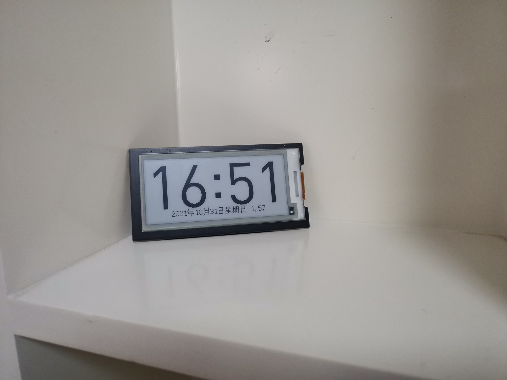

# EPD-Clock

## 简介

使用hanshuo电子价签中的2.9寸墨水屏、MSP430G2553单片机以及spi nor flash等元件设计制作了一款采用单节7号干电池供电的时钟。经过测试，在每天工作16小时的情况下，一节干电池可供其连续工作6个月左右。

详细内容见[github](https://github.com/ieiao/epd-clock)或[gitee](https://gitee.com/ieiao/epd-clock)。

## 后续

在现有设计的基础上，使用白嫖的ESP32C3模块对时钟进行了重新设计，新增的功能主要为网络校时，实时天气获取等；相应的，供电也更改为锂电池供电。电路及代码实现目前均很简陋，不过能用:)。经过测试，在使用600mah电池供电，每天工作16小时，每小时更新一次天气和时钟的情况下可连续工作50天左右。

详细内容见[github](https://github.com/ieiao/epd-clock)或[gitee](https://gitee.com/ieiao/epd-clock)的`esp32c3`分支。
